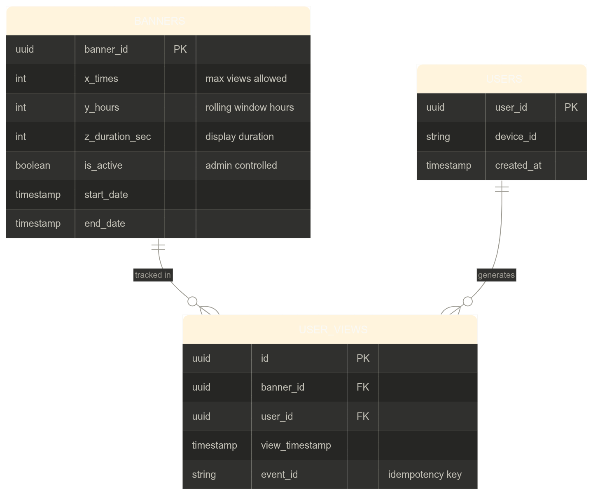
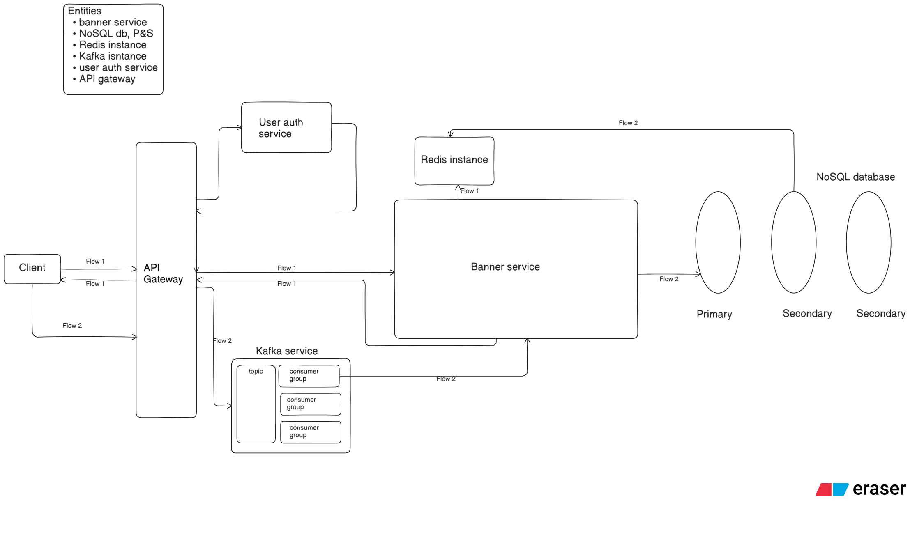

# Banner Display System — System Design

> Show a banner **X times** in **Y hours** for **Z seconds** duration, per user, at scale.

---

## Table of Contents

- [Banner Display System — System Design](#banner-display-system--system-design)
  - [Table of Contents](#table-of-contents)
  - [Problem Statement](#problem-statement)
  - [Functional Requirements](#functional-requirements)
    - [Core Parameters](#core-parameters)
    - [Decisions Made](#decisions-made)
  - [Non-Functional Requirements](#non-functional-requirements)
  - [Capacity Estimation](#capacity-estimation)
  - [API Design](#api-design)
    - [Client-Facing](#client-facing)
    - [CDN-Facing (not backend)](#cdn-facing-not-backend)
    - [Admin-Facing](#admin-facing)
    - [Internal (not exposed to client)](#internal-not-exposed-to-client)
  - [Database Schema](#database-schema)
    - [Banners Table](#banners-table)
    - [Users Table](#users-table)
    - [User Views Table](#user-views-table)
    - [Indexes](#indexes)
    - [Relationships](#relationships)
    - [Core quota query](#core-quota-query)
    - [ER Diagram](#er-diagram)
  - [High Level Architecture](#high-level-architecture)
    - [Components](#components)
  - [Deep Dives](#deep-dives)
    - [Flow 1 — Fetch Banners](#flow-1--fetch-banners)
    - [Flow 2 — View Event Pipeline](#flow-2--view-event-pipeline)
    - [Example walkthrough](#example-walkthrough)
    - [Caching Strategy](#caching-strategy)
    - [Idempotency](#idempotency)
    - [Fault Tolerance](#fault-tolerance)
  - [Low Level Design](#low-level-design)
    - [Class Structure - Banner Service](#class-structure---banner-service)
    - [Kafka Consumer — View Event Processor](#kafka-consumer--view-event-processor)
    - [Quota Check — Decision Flow](#quota-check--decision-flow)
    - [Cache Key Design](#cache-key-design)
  - [Trade-offs](#trade-offs)
  - [Future Optimizations](#future-optimizations)

---

## Problem Statement

Design a system that displays promotional banners inside a mobile application (e.g. Flipkart, Swiggy, Rapido) with the following constraint:

**Show a banner X times in Y hours, for Z seconds, per user.**

Example: Show a "Summer Sale" banner **2 times** in **24 hours**, for **3 seconds** each time it appears.

---

## Functional Requirements

### Core Parameters
| Parameter | Meaning |
|-----------|---------|
| X | Maximum number of times a banner is shown to a user in the Y-hour window |
| Y | Rolling time window in hours (e.g. 24 hours) |
| Z | Display duration in seconds — how long the banner stays on screen |

### Decisions Made

**Subject — Per user**
The X/Y quota is enforced independently per user. All users see the same global banner definitions, but each user has their own view count tracked separately. Personalization (different banners per user segment) is deferred to the optimization phase.

**Trigger — App open event**
A banner show opportunity is created every time a user opens the app. Accidental app opens (user closes the app within a short threshold) do not count as a trigger and do not show a banner.

**View definition — Two conditions count as a view:**
- The banner is visible on screen for more than Z seconds (full duration plays out)
- The user explicitly dismisses the banner before Z seconds (conscious rejection = counted)

What does NOT count as a view: the user closes the app accidentally within the threshold duration.

**Quota enforcement — Rolling window**
The Y-hour window is a rolling window per user, not a fixed daily reset. A view from 25 hours ago no longer counts against the quota. This avoids penalizing users who are active at non-standard hours.

**Quota cap — Soft**
X is a soft cap. Overshooting by 1-2 views due to race conditions is acceptable — it is in the business's favour. Undershooting (showing fewer banners than allowed) is a high-priority bug as it represents lost revenue opportunity.

**Tracking — Client reports, server verifies**
The client tracks view duration and reports a view event to the server. The server is the source of truth — it validates and persists. The client is trusted but always verified.

---

## Non-Functional Requirements

| NFR | Decision |
|-----|----------|
| Scale | 100 million requests per day |
| Latency | Ultra-low on banner fetch (sub 50ms) |
| Consistency | Eventual consistency is acceptable |
| Availability | High — banner service must not go down |
| Window type | Rolling 24-hour window per user |
| Write consistency | Write to primary DB first, then update cache asynchronously |

---

## Capacity Estimation

**Traffic:**
- 100M DAU, each triggering ~2-3 app opens per day
- Peak banner fetch QPS: ~100M × 3 / 86400 ≈ **3,500 QPS average**, peak ~3-5x = **~15,000 QPS**

**View events (writes):**
- Each user sees ~2 banners per day → 200M view events/day
- Write QPS: ~2,300 average, peak ~10,000 QPS

**Storage (user_views table):**
- Each row ≈ 100 bytes (UUIDs + timestamp + event_id)
- 200M rows/day × 100 bytes = **~20 GB/day**
- 30-day retention → ~600 GB, manageable with archival after rolling window expires

**Cache:**
- Per user-banner pair: ~50 bytes (view_count + oldest_timestamp)
- 100M users × 10 active banners = 1B entries × 50 bytes = **~50 GB Redis** — fits comfortably in a Redis cluster

---

## API Design

### Client-Facing

```
GET /banners
```
Called on every app open. Returns a list of eligible banner IDs for the authenticated user after quota check.

**Response:**
```json
{
  "banners": ["banner_uuid_1", "banner_uuid_2"],
  "user_id": "user_uuid"
}
```

---

```
POST /views
```
Called by client after a banner view event (full duration played or explicitly dismissed).

**Request body:**
```json
{
  "banner_id": "banner_uuid_1",
  "user_id": "user_uuid",
  "event_id": "unique_idempotency_key",
  "view_duration_ms": 3200,
  "dismissed": false
}
```

**Response:** `202 Accepted` — event is queued, not synchronously processed.

---

### CDN-Facing (not backend)

```
GET /banner/:banner_id
```
Served directly from CDN. Returns banner assets — image URL, title, description, CTA link. Backend is not involved in this call.

---

### Admin-Facing

```
POST /admin/banners
```
Create a new banner campaign with X, Y, Z config and active window.

**Request body:**
```json
{
  "x_times": 2,
  "y_hours": 24,
  "z_duration_sec": 3,
  "start_date": "2026-04-01T00:00:00Z",
  "end_date": "2026-04-30T23:59:59Z",
  "asset_url": "https://cdn.example.com/banners/summer-sale"
}
```

---

```
PATCH /admin/banners/:banner_id
```
Update banner config or toggle `is_active` to deactivate a campaign.

---

### Internal (not exposed to client)

Kafka consumer → batch write to primary DB → async cache update. This is server-internal and has no external API surface.

---

## Database Schema

### Banners Table
Stores global banner definitions. One row per campaign.

```
banners
─────────────────────────────────────────
banner_id       UUID        PRIMARY KEY
x_times         INT         max views allowed per user
y_hours         INT         rolling window in hours
z_duration_sec  INT         display duration in seconds
is_active       BOOLEAN     admin-controlled toggle
start_date      TIMESTAMP   campaign start
end_date        TIMESTAMP   campaign end
```

### Users Table
Minimal reference table. Owned by the auth/user service; referenced here.

```
users
─────────────────────────────────────────
user_id         UUID        PRIMARY KEY
device_id       VARCHAR     for device-level dedup if needed
created_at      TIMESTAMP
```

### User Views Table
One row per view event. This is the core tracking table.

```
user_views
─────────────────────────────────────────
id              UUID        PRIMARY KEY
banner_id       UUID        FOREIGN KEY → banners.banner_id
user_id         UUID        FOREIGN KEY → users.user_id
view_timestamp  TIMESTAMP   when the view was recorded
event_id        VARCHAR     unique idempotency key per view event
```

### Indexes
```sql
-- Fast quota check: how many times has this user seen this banner recently?
CREATE INDEX idx_user_banner ON user_views (user_id, banner_id);

-- Fast rolling window query
CREATE INDEX idx_view_timestamp ON user_views (view_timestamp);
```

### Relationships
```
BANNERS    ||--o{   USER_VIEWS   : "tracked in"
USERS      ||--o{   USER_VIEWS   : "generates"
```

### Core quota query
```sql
SELECT COUNT(*) 
FROM user_views
WHERE user_id = :user_id
  AND banner_id = :banner_id
  AND view_timestamp > NOW() - INTERVAL ':y_hours HOURS';
```
If count < x_times → show the banner. Else → skip.

### ER Diagram


## High Level Architecture



### Components

| Component | Role |
|-----------|------|
| API Gateway | Entry point, rate limiting, routes to auth + banner service |
| Auth Service | Validates JWT, extracts user_id for per-user quota checks |
| Banner Service | Core logic — quota check, banner eligibility, response assembly |
| Redis | Caches view_count + oldest_view_timestamp per (user_id, banner_id) |
| Kafka | Absorbs high-volume view events asynchronously, decouples client from DB |
| PostgreSQL | Persists banners and user_views; primary + 2 read replicas;  Leverages ACID transactions, foreign keys, and efficient |
| CDN | Serves banner assets (images, text, CTA) — bypasses backend entirely |

---

## Deep Dives

### Flow 1 — Fetch Banners

```
1. User opens app
2. Client calls GET /banners
3. API Gateway authenticates request via Auth Service → extracts user_id
4. Banner Service fetches all active banners from DB (is_active = true, within date range)
5. For each banner:
   a. Check Redis: get view_count and oldest_view_timestamp for (user_id, banner_id)
   b. If oldest_view_timestamp is older than Y hours → that view expired, decrement count
   c. If view_count < x_times → banner is eligible
   d. If Redis miss → fall back to primary DB query
6. Return list of eligible banner IDs to client
7. Client fetches banner assets from CDN using banner IDs
8. Client displays banner for Z seconds
```

---

### Flow 2 — View Event Pipeline

```
1. Banner displayed for Z seconds (or user dismisses it)
2. Client sends POST /views with event_id, banner_id, user_id
3. API Gateway routes to Kafka topic (fire and forget — returns 202 immediately)
4. Kafka consumer picks up the event:
   a. Check event_id against processed events table → skip if duplicate
   b. Batch write view record to primary DB
   c. Async update Redis: increment view_count, update oldest_view_timestamp if needed
5. Read replicas sync from primary asynchronously

```
---

### Example walkthrough
```
User A opens Flipkart at 9AM. 
7Summer Sale banner (X=2, Y=24hrs) has been seen once at 8AM yesterday (25 hours ago — expired). 
Redis shows view_count=1 but oldest_view_timestamp is 25hrs old so count effectively = 0. 
Banner is shown. User watches for 3 seconds. 
POST /views fired. Kafka consumes event. 
Redis updated to view_count=1 with new timestamp.
```
---

### Caching Strategy

**Cache structure per (user_id, banner_id):**
```
{
  "view_count": 1,
  "oldest_view_timestamp": "2026-04-09T14:00:00Z"
}
```

**Why store oldest_view_timestamp and not all timestamps?**
We only need to know when the earliest view in the current window expires. Once it expires (older than Y hours), we decrement the count. This keeps the cache entry tiny and O(1) to evaluate.

**Cache TTL:** Set to Y hours. After the window expires, the key is evicted automatically — no manual cleanup needed.

**Write strategy:** Write to primary DB first (source of truth), then update cache asynchronously. If cache update fails, DB is correct and cache will be rebuilt on next miss.

---

### Idempotency

Every view event from the client includes a unique `event_id` (e.g. `user_123_banner_456_1712656789_random`). The Kafka consumer checks this before processing:

```
IF event_id already in processed_events → discard
ELSE → process + mark event_id as processed
```

This prevents duplicate view counts caused by client retries, network issues, or Kafka redelivery.

---

### Fault Tolerance

| Failure | Behaviour |
|---------|-----------|
| Redis down | Fall back to primary DB for quota check. Slower but accurate. |
| Kafka down | Client retries with backoff. View events may be delayed but not lost. |
| Primary DB down | Read replicas serve quota checks (slightly stale). Writes queue in Kafka until primary recovers. |
| Banner service down | API Gateway returns empty banner list. App renders normally without banners. |

---

## Low Level Design

### Class Structure - Banner Service
```
BannerService
├── fetchEligibleBanners(user_id: UUID): BannerID[]
│     ├── getActiveBanners(): Banner[]
│     ├── checkQuota(user_id, banner_id): boolean
│     │     ├── getCachedQuota(user_id, banner_id): QuotaEntry | null
│     │     ├── isWindowExpired(oldest_view_timestamp, y_hours): boolean
│     │     └── fallbackToDb(user_id, banner_id, y_hours): int
│     └── buildResponse(eligible_banners): BannerID[]
│
└── recordViewEvent(event: ViewEvent): void
├── isIdempotent(event_id): boolean
├── publishToKafka(event): void
└── return 202 Accepted

QuotaEntry
├── view_count: int
├── oldest_view_timestamp: timestamp
└── isExpired(y_hours): boolean

ViewEvent
├── event_id: string         ← idempotency key
├── user_id: UUID
├── banner_id: UUID
├── view_duration_ms: int
└── dismissed: boolean

AdminService
├── createBanner(payload: CreateBannerPayload): Banner
│     ├── validate(payload)
│     │     ├── x_times > 0
│     │     ├── y_hours > 0
│     │     ├── z_duration_sec > 0
│     │     └── start_date < end_date
│     ├── persist(payload) → primary DB (banners table)
│     └── return created Banner
```

### Kafka Consumer — View Event Processor
```
ViewEventConsumer
├── consume(event: ViewEvent): void
│     ├── checkIdempotency(event_id) → skip if duplicate
│     ├── batchWrite(event) → primary DB (user_views table)
│     └── updateCache(user_id, banner_id)
│           ├── increment view_count
│           └── update oldest_view_timestamp if this is the new oldest
│
└── flush(): void   ← triggered every N events or T milliseconds
```
### Quota Check — Decision Flow
```
checkQuota(user_id, banner_id, x, y_hours):
  entry = Redis.get(user_id, banner_id)
  if entry is null:
    count = DB.query(user_id, banner_id, y_hours)  ← fallback
    return count < x
  if isExpired(entry.oldest_view_timestamp, y_hours):
    entry.view_count -= 1
    Redis.set(user_id, banner_id, entry)
    return entry.view_count < x

  return entry.view_count < x
```
### Cache Key Design
```
Key:   banner_quota:{user_id}:{banner_id}
Value: { view_count: int, oldest_view_timestamp: timestamp }
TTL:   Y hours (auto-evicts after window expires)
```

---


## Trade-offs

| Decision | Trade-off |
|----------|-----------|
| Eventual consistency | Accepted slight staleness in view counts to avoid distributed locking at 100M scale |
| Soft quota cap | Allows 1-2 overage views rather than using expensive distributed counters for hard enforcement |
| Rolling window over fixed reset | More fair to users across time zones but slightly more complex cache logic |
PostgreSQL over NoSQL | Schema is strongly relational with FK constraints and range queries. Postgres handles this cleanly. Write scale managed via connection pooling (PgBouncer) and read replicas. |
| Kafka for view events | Decouples client from DB write latency; adds operational complexity |
| CDN for assets | Removes banner asset serving from hot path; requires asset pre-registration |

---

## Future Optimizations

- **Personalization:** Introduce a user segment table and map banners to segments. Show different banners to different user cohorts based on behaviour, region, or purchase history.
- **Smart scheduling:** Instead of pure rolling window, analyse each user's active hours and schedule banner shows during peak engagement windows.
- **Banner priority/ranking:** When multiple banners are eligible, rank them by CTR, revenue potential, or recency rather than returning them in arbitrary order.
- **Analytics pipeline:** Feed view events into a data warehouse (via Kafka → Flink → S3 → Redshift) for campaign performance dashboards.
- **A/B testing:** Support multiple creative variants per banner_id and randomly assign users to variants to test which performs better.
- **Geo-distribution:** Deploy banner service in multiple regions. Route users to nearest region via GeoDNS. Accept cross-region eventual consistency.
- **Postgres partitioning:** Partition user_views table by view_timestamp monthly. Drop partitions older than Y hours automatically instead of row-level deletes.
- **PgBouncer:** Connection pooler in front of Postgres to handle 10K+ concurrent connections at peak traffic.